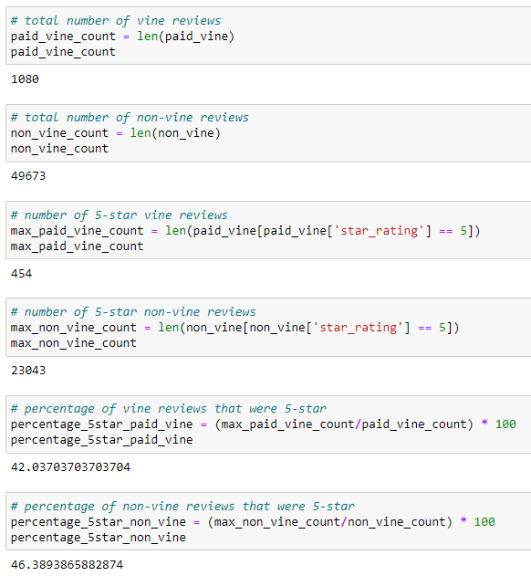

# Amazon_Vine_Analysis

## Overview

The purpose of this analysis was to find out whether there is any discernible bias towards favorable reviews by Vine members as opposed to reviews by non-members. The results were achieved by specifically looking at electronics, filtering for significant numbers of reviews that were considered helpful, and then looking at how many 5-star reviews were made by Vine members and non-Vine members.

## Results

- As seen in the above image, there were a total of 1,080 Vine reviews and 49,673 non-Vine reviews.
- Of these, there were a total of 454 5-star reviews made by Vine members and 2,3043 5-star reviews made by non-Vine members.
- This translates to 42% of the Vine reviews being 5-star reviews and 46% of the non-Vine reviews being 5-star reviews.

## Summary

The results obtained would not support a positivity bias for reviewers in the Vine program. An additional analysis that could be run is to reduce the filter threshold number of reviews that were considered helpful to possibly see if there could be other factors that would change the results obtained above.
